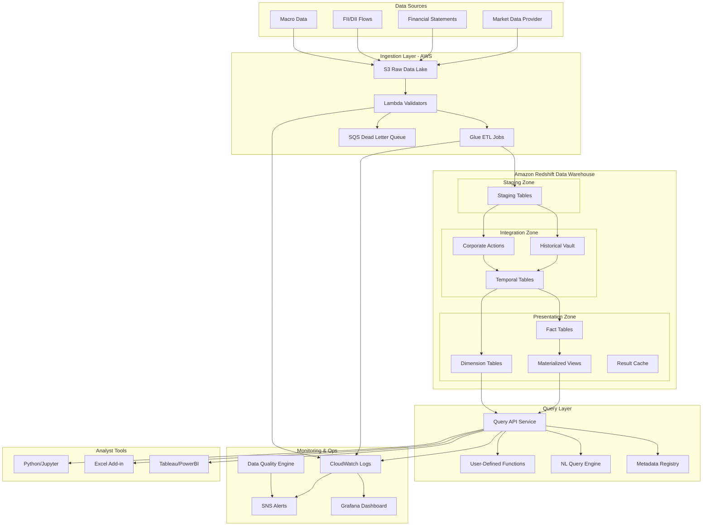

# Design Document: Research Data Platform V2

## Overview

The Research Data Platform V2 is a temporal data warehouse built on AWS using Amazon Redshift, designed to provide research-safe financial data for equity investment analysis. The platform implements a layered architecture with staging, integration, and presentation zones, ensuring point-in-time correctness, survivorship-bias-free analysis, and sub-5-second query performance for typical analytical workloads.

The system handles daily price updates for 3000+ securities, quarterly financial statements, institutional flow data, and macro variables, serving 5-8 analysts with concurrent access. The design prioritizes data integrity over raw performance, implements comprehensive temporal versioning, and provides query abstractions that prevent look-ahead bias.

## Architecture

### High-Level System Architecture



### Architecture Layers


1. **Ingestion Layer (AWS)**: Receives raw data files, validates format and completeness, orchestrates ETL jobs
2. **Staging Zone (Redshift)**: Temporary landing area for raw data with minimal transformation
3. **Integration Zone (Redshift)**: Applies business logic, temporal versioning, corporate action adjustments
4. **Presentation Zone (Redshift)**: Optimized star schema with materialized views and precomputed features
5. **Query Layer**: API service with UDFs, natural language translation, and metadata-driven validation
6. **Monitoring Layer**: Data quality checks, pipeline monitoring, cost tracking, alerting

### Technology Stack

- **Cloud Platform**: AWS (S3, Lambda, Glue, CloudWatch, SNS, EventBridge)
- **Data Warehouse**: Amazon Redshift (RA3.4xlarge cluster with 2-4 nodes, auto-scaling enabled)
- **Orchestration**: AWS Step Functions + Apache Airflow on ECS
- **Query Layer**: Python FastAPI service hosted on AWS ECS Fargate
- **Monitoring**: CloudWatch + Grafana + custom data quality framework
- **Version Control**: Git for query functions, dbt for data transformations
- **Natural Language**: LangChain with custom SQL validator (LLM integration point)

## Components and Interfaces

### 1. Data Ingestion Pipeline

#### Component: S3 Raw Data Lake


**Purpose**: Centralized landing zone for all external data files

**Structure**:
```
s3://itus-data-lake/
  ├── raw/
  │   ├── prices/YYYY/MM/DD/
  │   ├── financials/YYYY/QQ/
  │   ├── flows/YYYY/MM/DD/
  │   └── macro/YYYY/MM/DD/
  ├── processed/
  └── archive/
```

**Interface**: S3 Event Notifications trigger Lambda validators on file arrival

#### Component: Lambda Validation Functions

**Purpose**: Immediate validation of incoming data files before processing

**Validations**:
- File format and schema compliance
- Required fields present and non-null
- Date ranges within expected bounds
- Referential integrity (security IDs exist)
- Statistical outlier detection (price changes > 50%)

**Output**: Valid files → trigger Glue ETL; Invalid files → SQS dead letter queue + SNS alert

#### Component: Glue ETL Jobs

**Purpose**: Transform and load data from S3 to Redshift staging tables


**Jobs**:
- `daily_prices_etl`: Loads daily OHLCV data with unadjusted prices
- `quarterly_financials_etl`: Loads income statement, balance sheet, cash flow
- `daily_flows_etl`: Loads FII/DII institutional flow data
- `corporate_actions_etl`: Loads splits, dividends, mergers
- `index_constituents_etl`: Loads index membership changes

**Incremental Logic**: Uses high-water marks stored in Redshift control table to process only new data

### 2. Temporal Data Model

#### Core Design Principle: Bi-Temporal Tables

All mutable data uses bi-temporal design with two time dimensions:

1. **Valid Time**: When the fact was true in the real world (e.g., reporting period)
2. **Transaction Time**: When the fact was recorded in the database (e.g., publication date)

#### Component: Historical Vault Tables

**Purpose**: Immutable append-only storage of all data versions

**Schema Pattern**:
```sql
CREATE TABLE vault_financials (
    vault_key BIGINT IDENTITY(1,1),
    security_id INTEGER,
    reporting_period_end DATE,
    metric_name VARCHAR(100),
    metric_value DECIMAL(18,4),
    publication_date DATE,
    source_file VARCHAR(500),
    valid_from TIMESTAMP,
    valid_to TIMESTAMP,
    is_current BOOLEAN,
    hash_diff VARCHAR(64),
    load_timestamp TIMESTAMP DEFAULT GETDATE()
)
DISTSTYLE KEY
DISTKEY(security_id)
SORTKEY(security_id, reporting_period_end);
```


**Key Features**:
- Never delete or update records, only insert new versions
- `valid_from` and `valid_to` track when each version was the current truth
- `publication_date` enables point-in-time queries
- `hash_diff` detects changes for incremental processing
- Supports financial restatements by maintaining multiple versions

#### Component: Corporate Actions Engine

**Purpose**: Calculate adjustment factors and apply to historical prices

**Tables**:

```sql
CREATE TABLE corporate_actions (
    action_id INTEGER IDENTITY(1,1),
    security_id INTEGER,
    action_type VARCHAR(20), -- SPLIT, DIVIDEND, BONUS, RIGHTS, MERGER
    ex_date DATE,
    record_date DATE,
    payment_date DATE,
    adjustment_factor DECIMAL(18,10),
    details VARCHAR(MAX) -- JSON stored as string
)
DISTSTYLE KEY
DISTKEY(security_id)
SORTKEY(security_id, ex_date);

CREATE TABLE price_adjustments (
    security_id INTEGER,
    price_date DATE,
    unadjusted_close DECIMAL(18,4),
    adjustment_factor DECIMAL(18,10),
    adjusted_close DECIMAL(18,4),
    cumulative_factor DECIMAL(18,10)
)
DISTSTYLE KEY
DISTKEY(security_id)
COMPOUND SORTKEY(security_id, price_date);
```

**Adjustment Logic**:
- Calculate cumulative adjustment factor from all corporate actions after each date
- For stock split 1:2 on date D, all prices before D are multiplied by 0.5
- For dividend of Rs 10 on stock trading at Rs 100, adjustment factor = 90/100 = 0.9
- Adjustments cascade: if multiple actions occur, factors multiply


### 3. Presentation Layer Star Schema

#### Fact Tables

**fact_daily_prices**:
```sql
CREATE TABLE fact_daily_prices (
    price_date DATE,
    security_key INTEGER,
    open_price DECIMAL(18,4),
    high_price DECIMAL(18,4),
    low_price DECIMAL(18,4),
    close_price DECIMAL(18,4),
    adjusted_close DECIMAL(18,4),
    volume BIGINT,
    turnover DECIMAL(18,2),
    data_source VARCHAR(50)
)
DISTSTYLE KEY
DISTKEY(security_key)
COMPOUND SORTKEY(price_date, security_key);
```

**fact_quarterly_financials**:
```sql
CREATE TABLE fact_quarterly_financials (
    reporting_period_end DATE,
    publication_date DATE,
    security_key INTEGER,
    revenue DECIMAL(18,2),
    ebitda DECIMAL(18,2),
    net_income DECIMAL(18,2),
    total_assets DECIMAL(18,2),
    total_equity DECIMAL(18,2),
    -- 50+ financial metrics
    as_of_date DATE -- for point-in-time queries
)
DISTSTYLE KEY
DISTKEY(security_key)
COMPOUND SORTKEY(security_key, reporting_period_end);
```

**fact_institutional_flows**:
```sql
CREATE TABLE fact_institutional_flows (
    flow_date DATE,
    security_key INTEGER,
    fii_buy_value DECIMAL(18,2),
    fii_sell_value DECIMAL(18,2),
    dii_buy_value DECIMAL(18,2),
    dii_sell_value DECIMAL(18,2),
    net_fii_flow DECIMAL(18,2),
    net_dii_flow DECIMAL(18,2)
)
DISTSTYLE KEY
DISTKEY(security_key)
COMPOUND SORTKEY(flow_date, security_key);
```


#### Dimension Tables (Type 2 Slowly Changing Dimensions)

**dim_security**:
```sql
CREATE TABLE dim_security (
    security_key INTEGER IDENTITY(1,1),
    security_id VARCHAR(50), -- ISIN or NSE symbol
    security_name VARCHAR(200),
    sector VARCHAR(100),
    industry VARCHAR(100),
    market_cap_category VARCHAR(20),
    listing_date DATE,
    delisting_date DATE,
    delisting_reason VARCHAR(200),
    is_current BOOLEAN,
    valid_from DATE,
    valid_to DATE
)
DISTSTYLE ALL
SORTKEY(security_key);
```

**dim_index_constituents**:
```sql
CREATE TABLE dim_index_constituents (
    index_name VARCHAR(50),
    security_key INTEGER,
    effective_date DATE,
    exit_date DATE,
    is_current BOOLEAN
)
DISTSTYLE ALL
SORTKEY(index_name, effective_date);
```

**dim_date**:
```sql
CREATE TABLE dim_date (
    date_key DATE PRIMARY KEY,
    year INTEGER,
    quarter INTEGER,
    month INTEGER,
    week INTEGER,
    day_of_week INTEGER,
    is_trading_day BOOLEAN,
    is_month_end BOOLEAN,
    is_quarter_end BOOLEAN,
    fiscal_year INTEGER,
    fiscal_quarter INTEGER
)
DISTSTYLE ALL
SORTKEY(date_key);
```


#### Materialized Views for Performance

**mv_current_index_constituents**:
```sql
CREATE MATERIALIZED VIEW mv_current_index_constituents AS
SELECT 
    index_name,
    security_key,
    s.security_id,
    s.security_name,
    s.sector
FROM dim_index_constituents ic
JOIN dim_security s ON ic.security_key = s.security_key
WHERE ic.is_current = TRUE AND s.is_current = TRUE;
```

**mv_precomputed_ratios**:
```sql
CREATE MATERIALIZED VIEW mv_precomputed_ratios AS
SELECT
    security_key,
    reporting_period_end,
    revenue,
    ebitda,
    net_income,
    total_assets,
    total_equity,
    ebitda / NULLIF(revenue, 0) AS ebitda_margin,
    net_income / NULLIF(revenue, 0) AS net_margin,
    total_equity / NULLIF(total_assets, 0) AS equity_ratio,
    -- 20+ precomputed ratios
FROM fact_quarterly_financials;
```

**mv_rolling_returns**:
```sql
CREATE MATERIALIZED VIEW mv_rolling_returns AS
SELECT
    security_key,
    price_date,
    adjusted_close,
    LAG(adjusted_close, 21) OVER (PARTITION BY security_key ORDER BY price_date) AS price_1m_ago,
    LAG(adjusted_close, 126) OVER (PARTITION BY security_key ORDER BY price_date) AS price_6m_ago,
    (adjusted_close / price_1m_ago - 1) AS return_1m,
    (adjusted_close / price_6m_ago - 1) AS return_6m
FROM fact_daily_prices;
```

Refresh schedule: Daily at 7 AM IST after data ingestion completes (using Redshift scheduled queries or Airflow)


### 4. Query Abstraction Layer

#### Component: User-Defined Functions (UDFs)

**Purpose**: Encapsulate common query patterns with built-in point-in-time correctness

**Key UDFs**:

```sql
-- Get index constituents as of a specific date
CREATE FUNCTION get_index_constituents(
    p_index_name VARCHAR,
    p_as_of_date DATE
)
RETURNS TABLE (security_key NUMBER, security_id VARCHAR, security_name VARCHAR)
AS
$$
    SELECT ic.security_key, s.security_id, s.security_name
    FROM dim_index_constituents ic
    JOIN dim_security s ON ic.security_key = s.security_key
    WHERE ic.index_name = p_index_name
      AND ic.effective_date <= p_as_of_date
      AND (ic.exit_date IS NULL OR ic.exit_date > p_as_of_date)
      AND s.valid_from <= p_as_of_date
      AND (s.valid_to IS NULL OR s.valid_to > p_as_of_date)
$$;

-- Get financial metric time series with point-in-time correctness
CREATE FUNCTION get_financial_metric_series(
    p_security_key NUMBER,
    p_metric_name VARCHAR,
    p_start_date DATE,
    p_end_date DATE,
    p_as_of_date DATE DEFAULT CURRENT_DATE
)
RETURNS TABLE (reporting_period_end DATE, metric_value DECIMAL)
AS
$$
    SELECT reporting_period_end, metric_value
    FROM fact_quarterly_financials
    WHERE security_key = p_security_key
      AND reporting_period_end BETWEEN p_start_date AND p_end_date
      AND publication_date <= p_as_of_date
    ORDER BY reporting_period_end
$$;
```


```sql
-- Calculate revenue CAGR
CREATE FUNCTION calculate_revenue_cagr(
    p_security_key NUMBER,
    p_years NUMBER,
    p_as_of_date DATE DEFAULT CURRENT_DATE
)
RETURNS DECIMAL
AS
$$
    WITH revenue_data AS (
        SELECT 
            MIN(revenue) AS start_revenue,
            MAX(revenue) AS end_revenue
        FROM fact_quarterly_financials
        WHERE security_key = p_security_key
          AND reporting_period_end BETWEEN 
              DATEADD(year, -p_years, p_as_of_date) AND p_as_of_date
          AND publication_date <= p_as_of_date
    )
    SELECT POWER(end_revenue / NULLIF(start_revenue, 0), 1.0 / p_years) - 1
    FROM revenue_data
$$;
```

**UDF Library Management**:
- All UDFs stored in Git repository with version tags
- Deployment via dbt with automated testing
- Each UDF includes inline documentation and example usage
- Analysts can propose new UDFs via pull request

#### Component: Query API Service

**Purpose**: Python FastAPI service providing REST endpoints and query validation

**Architecture**:
```
FastAPI Service (ECS Fargate)
├── /api/v1/query/execute
├── /api/v1/query/validate
├── /api/v1/nl/translate
├── /api/v1/metadata/schema
└── /api/v1/cache/invalidate
```


**Key Features**:
- Connection pooling to Redshift with automatic retry
- Query result caching (Redis) with 24-hour TTL
- Query cost estimation before execution
- Automatic query timeout enforcement
- Audit logging of all queries with user attribution

**Example API Request**:
```json
POST /api/v1/query/execute
{
    "query": "SELECT * FROM TABLE(get_index_constituents('NIFTY500', '2020-01-01'))",
    "as_of_date": "2020-01-01",
    "cache_enabled": true,
    "timeout_seconds": 60
}
```

#### Component: Metadata Registry

**Purpose**: Centralized schema metadata for query validation and natural language translation

**Schema**:
```sql
CREATE TABLE metadata_tables (
    table_name VARCHAR,
    table_type VARCHAR, -- FACT, DIMENSION, VIEW
    temporal_type VARCHAR, -- POINT_IN_TIME, SNAPSHOT, IMMUTABLE
    description TEXT,
    primary_date_column VARCHAR
);

CREATE TABLE metadata_columns (
    table_name VARCHAR,
    column_name VARCHAR,
    data_type VARCHAR,
    is_temporal_key BOOLEAN,
    description TEXT,
    business_glossary_term VARCHAR
);

CREATE TABLE metadata_relationships (
    parent_table VARCHAR,
    child_table VARCHAR,
    join_type VARCHAR,
    join_condition TEXT,
    temporal_constraint TEXT
);
```


**Usage**: 
- Query validator checks that joins match approved relationships
- Natural language engine uses descriptions to map terms to columns
- Temporal constraints enforce point-in-time correctness rules

### 5. Natural Language Query Engine

#### Component: NL-to-SQL Translation Service

**Purpose**: Convert natural language queries to validated SQL

**Architecture**:
```
Natural Language Query
    ↓
Intent Parser (LangChain + LLM)
    ↓
SQL Generator (with metadata context)
    ↓
Temporal Validator
    ↓
Performance Estimator
    ↓
Approved SQL / Rejection with suggestions
```

**Example Translation**:

Input: "Show me midcap stocks with improving EBITDA margins and positive 6-month momentum"

Generated SQL:
```sql
WITH current_midcaps AS (
    SELECT security_key
    FROM dim_security
    WHERE market_cap_category = 'MIDCAP'
      AND is_current = TRUE
),
margin_improvement AS (
    SELECT 
        security_key,
        reporting_period_end,
        ebitda_margin,
        LAG(ebitda_margin, 4) OVER (PARTITION BY security_key ORDER BY reporting_period_end) AS margin_1y_ago
    FROM mv_precomputed_ratios
    WHERE reporting_period_end >= DATEADD(year, -2, CURRENT_DATE)
),
momentum AS (
    SELECT security_key, return_6m
    FROM mv_rolling_returns
    WHERE price_date = CURRENT_DATE - 1
)
SELECT 
    s.security_id,
    s.security_name,
    m.ebitda_margin,
    m.margin_1y_ago,
    mom.return_6m
FROM current_midcaps cm
JOIN dim_security s ON cm.security_key = s.security_key
JOIN margin_improvement m ON cm.security_key = m.security_key
JOIN momentum mom ON cm.security_key = mom.security_key
WHERE m.ebitda_margin > m.margin_1y_ago
  AND mom.return_6m > 0
  AND m.reporting_period_end = (
      SELECT MAX(reporting_period_end) 
      FROM margin_improvement 
      WHERE security_key = m.security_key
  );
```


#### Temporal Validator

**Purpose**: Ensure generated SQL maintains point-in-time correctness

**Validation Rules**:
1. All temporal tables must include `as_of_date` or `publication_date` filter
2. Joins between tables with different temporal granularities must align on valid time ranges
3. No future-dated data can be referenced relative to analysis date
4. Window functions must not look forward in time

**Example Rejection**:
```
Query rejected: Join between fact_daily_prices and fact_quarterly_financials 
does not include temporal alignment. 

Suggestion: Add condition:
AND f.publication_date <= p.price_date
```

#### Performance Estimator

**Purpose**: Prevent expensive queries from executing

**Estimation Logic**:
- Parse query plan from Snowflake EXPLAIN
- Estimate rows scanned based on partition pruning
- Calculate cost based on Snowflake credit pricing
- Reject queries exceeding 100 million rows without explicit approval

**Example Warning**:
```
Query will scan approximately 500M rows (estimated cost: $2.50).
Consider:
1. Adding date range filter to fact_daily_prices
2. Using materialized view mv_rolling_returns instead
3. Requesting batch execution during off-hours
```


### 6. Data Quality Framework

#### Component: Data Quality Engine

**Purpose**: Automated validation of all incoming data

**Rule Categories**:

1. **Schema Validation**:
   - Column names and types match expected schema
   - Required fields are non-null
   - String lengths within bounds

2. **Referential Integrity**:
   - Security IDs exist in dim_security
   - Dates exist in dim_date
   - Foreign key relationships valid

3. **Business Rules**:
   - Prices are positive
   - Price changes < 50% day-over-day (except corporate actions)
   - Financial metrics within reasonable ranges
   - Flow values sum to expected totals

4. **Completeness Checks**:
   - Expected number of securities present
   - No gaps in date sequences
   - All index constituents have price data

5. **Consistency Checks**:
   - Balance sheet balances (Assets = Liabilities + Equity)
   - Cash flow statement reconciles
   - Duplicate records detected

**Implementation**:
```python
# Example data quality rule
class PriceChangeRule(DataQualityRule):
    def validate(self, df):
        df['pct_change'] = df.groupby('security_id')['close_price'].pct_change()
        outliers = df[abs(df['pct_change']) > 0.5]
        
        if len(outliers) > 0:
            # Check if corporate action explains the change
            corp_actions = self.get_corporate_actions(
                outliers['security_id'].unique(),
                outliers['price_date'].unique()
            )
            unexplained = outliers[~outliers['security_id'].isin(corp_actions['security_id'])]
            
            if len(unexplained) > 0:
                return ValidationResult(
                    status='FAIL',
                    message=f'{len(unexplained)} unexplained price changes > 50%',
                    failed_records=unexplained
                )
        
        return ValidationResult(status='PASS')
```


#### Component: Data Quality Dashboard

**Purpose**: Real-time visibility into data quality metrics

**Metrics Tracked**:
- Validation pass rate by data source
- Failed record count by rule type
- Data freshness (time since last successful load)
- Completeness percentage (expected vs actual records)
- Trend analysis of quality metrics over time

**Alerting**:
- Critical failures: Immediate SNS alert to operations team
- Warning-level issues: Daily digest email
- Quality degradation: Alert if pass rate drops below 95%

### 7. Optimization Strategies

#### Partitioning Strategy

**Note**: Redshift does not support traditional partitioning like other databases. Instead, we use:

1. **Sort Keys for Data Ordering**: Compound sort keys on date columns enable zone map pruning
2. **Date-Based Table Partitioning (Manual)**: For very large historical data, split into separate tables by year
3. **Automatic Table Optimization (ATO)**: Redshift automatically sorts and optimizes tables in the background

**fact_daily_prices**: 
- COMPOUND SORTKEY(price_date, security_key)
- Zone maps automatically track min/max dates per block
- Queries with date filters skip irrelevant blocks

**fact_quarterly_financials**: 
- COMPOUND SORTKEY(security_key, reporting_period_end)
- Optimized for single-security time series queries
- Zone maps enable efficient date range filtering

**fact_institutional_flows**: 
- COMPOUND SORTKEY(flow_date, security_key)
- Similar pattern to prices for consistent query performance

#### Clustering Strategy

**Distribution Keys (DISTKEY)**:

**fact_daily_prices**: DISTKEY(security_key)
- Co-locates all price history for a security on same node
- Minimizes network traffic for single-stock queries
- Enables efficient joins with dimension tables

**fact_quarterly_financials**: DISTKEY(security_key)
- Same distribution as prices for efficient joins
- Co-locates all financial data for a security
- Optimizes for company-level analysis

**fact_institutional_flows**: DISTKEY(security_key)
- Consistent distribution strategy across all fact tables
- Enables efficient multi-fact joins on security_key

**Dimension Tables**:
- Small dimensions (< 1M rows): DISTSTYLE ALL (replicated to all nodes)
- Large dimensions: DISTKEY on primary key
- Eliminates network traffic for dimension joins


#### Caching Strategy

**Query Result Cache (Redis)**:
- Cache identical queries for 24 hours
- Invalidate on data refresh
- Store up to 10,000 most recent queries
- Estimated cache hit rate: 40-50%

**Materialized Views**:
- Precompute expensive aggregations
- Refresh daily after data ingestion
- Trade storage (additional 200 GB) for query speed (5-10x faster)

**Redshift Result Cache**:
- Automatic caching of identical queries
- Enabled by default, no configuration needed
- Complements application-level cache

#### Precomputation Strategy

**What to Precompute**:
1. Financial ratios (margins, returns, leverage)
2. Rolling returns (1M, 3M, 6M, 1Y, 3Y)
3. Index constituent lists (current snapshot)
4. Sector aggregations
5. Percentile rankings (P/E, P/B, market cap)

**What NOT to Precompute**:
1. Ad-hoc custom calculations
2. Rarely accessed metrics
3. Metrics requiring parameters (e.g., custom date ranges)

**Storage vs Compute Trade-off**:
- Precomputed features add ~300 GB storage
- Reduce query time from 15-30s to 2-5s
- Save ~$500/month in compute costs
- ROI positive after 2 months


#### Redshift-Specific Optimizations

**Cluster Configuration**:
- Node type: RA3.4xlarge (12 vCPU, 96 GB RAM, managed storage)
- Initial cluster: 2 nodes (192 GB RAM, 24 vCPU total)
- Auto-scaling: Scale to 4 nodes during peak hours (8 AM - 6 PM IST)
- Concurrency Scaling: Enabled for read queries (up to 10 concurrent clusters)
- Workload Management (WLM): 3 queues (ETL, Analyst, Admin)

**WLM Queue Configuration**:
```
Queue 1 (ETL): 40% memory, 2 slots, timeout 1 hour
Queue 2 (Analyst): 50% memory, 5 slots, timeout 5 minutes  
Queue 3 (Admin): 10% memory, 1 slot, no timeout
```

**Distribution Styles**:
- Large fact tables: KEY distribution on security_key
- Dimension tables < 1M rows: ALL distribution (replicated to all nodes)
- Dimension tables > 1M rows: KEY distribution on primary key
- Staging tables: EVEN distribution for parallel loading

**Sort Keys**:
- fact_daily_prices: COMPOUND sort key (price_date, security_key)
- fact_quarterly_financials: COMPOUND sort key (security_key, reporting_period_end)
- fact_institutional_flows: COMPOUND sort key (flow_date, security_key)
- Dimension tables: Sort on primary key

**Compression**:
- Automatic compression (ANALYZE COMPRESSION)
- Typical compression ratio: 3-4x for numeric columns
- 8-10x for varchar columns with low cardinality


## Data Models

### Temporal Data Modeling Pattern

All mutable data follows a bi-temporal pattern with two time dimensions:

1. **Valid Time (Business Time)**: When the fact was true in reality
   - Example: Reporting period end date for financial statements
   
2. **Transaction Time (System Time)**: When we learned about the fact
   - Example: Publication date when financial statement was released

This enables point-in-time queries: "What did we know about company X on date Y?"

### Example: Financial Statement with Restatement

```
Original Record (loaded 2023-04-15):
- reporting_period_end: 2022-12-31
- publication_date: 2023-04-15
- revenue: 1000
- valid_from: 2023-04-15
- valid_to: NULL
- is_current: TRUE

Restated Record (loaded 2023-07-20):
- reporting_period_end: 2022-12-31
- publication_date: 2023-07-20
- revenue: 950
- valid_from: 2023-07-20
- valid_to: NULL
- is_current: TRUE

Original Record (updated):
- valid_to: 2023-07-20
- is_current: FALSE
```

Query as of 2023-05-01 returns revenue = 1000
Query as of 2023-08-01 returns revenue = 950


## Error Handling

### Data Ingestion Errors

**Validation Failures**:
- Lambda validators catch format errors before data enters Redshift
- Failed files moved to S3 quarantine bucket
- SNS alert sent to operations team with error details
- Manual review and correction required

**ETL Job Failures**:
- Glue jobs implement transaction boundaries
- Failed batches rolled back automatically
- Job state persisted in control table
- Automatic retry with exponential backoff (3 attempts)
- After 3 failures, alert operations team

**Data Quality Failures**:
- Quality checks run after staging load, before production promotion
- Failed checks prevent data from reaching presentation layer
- Quarantine tables hold suspect data for investigation
- Analysts notified via dashboard that data refresh is incomplete

### Query Errors

**Timeout Errors**:
- Ad-hoc queries: 60-second timeout
- Scheduled reports: 300-second timeout
- Return partial results with timeout warning
- Suggest query optimization or batch execution

**Resource Errors**:
- WLM queue full: Queue query with estimated wait time
- Concurrency limit reached: Automatically route to concurrency scaling cluster
- Disk space errors: Alert operations, trigger vacuum/analyze

**Syntax Errors**:
- Return clear error message with line number
- Suggest corrections based on common mistakes
- Log error for pattern analysis


## Testing Strategy

### Unit Testing

**Data Transformation Logic**:
- Test corporate action adjustment calculations
- Test temporal query functions with known inputs/outputs
- Test data quality validation rules
- Framework: pytest with Redshift test fixtures

**API Endpoints**:
- Test query validation logic
- Test natural language translation
- Test authentication and authorization
- Framework: pytest with FastAPI TestClient

### Integration Testing

**End-to-End Data Flow**:
- Load sample data files to S3
- Verify data flows through staging → integration → presentation
- Validate final query results match expected values
- Test incremental refresh logic

**Query Performance Testing**:
- Benchmark common query patterns
- Verify sub-5-second response for typical queries
- Test concurrent query execution (8 users)
- Identify slow queries for optimization

### Data Quality Testing

**Point-in-Time Correctness**:
- Create test dataset with known temporal versions
- Query at different as-of dates
- Verify correct version returned for each date
- Test restatement handling

**Survivorship Bias Testing**:
- Create test index with additions/deletions
- Query historical constituents at various dates
- Verify delisted securities included when appropriate
- Verify current-only queries exclude delisted securities

### User Acceptance Testing

**Analyst Workflows**:
- Test common analysis patterns with real analysts
- Verify query abstractions are intuitive
- Validate natural language query accuracy
- Gather feedback on performance and usability


## Key Risks and Trade-offs

### Risk 1: Temporal Complexity

**Risk**: Bi-temporal data model adds complexity that analysts may find confusing

**Mitigation**:
- Encapsulate temporal logic in UDFs
- Provide simple "current data" views for common cases
- Training and documentation for analysts
- Query abstraction layer hides complexity

**Trade-off**: Complexity vs correctness - we prioritize correctness

### Risk 2: Query Performance

**Risk**: Point-in-time queries may be slower than simple current-state queries

**Mitigation**:
- Aggressive use of materialized views
- Precompute common temporal snapshots (month-end, quarter-end)
- Redshift concurrency scaling for peak loads
- Query result caching

**Trade-off**: Storage cost vs query speed - we accept 15-20% higher storage for 5-10x faster queries

### Risk 3: Data Quality Dependencies

**Risk**: Platform depends on external data quality; garbage in, garbage out

**Mitigation**:
- Comprehensive validation at ingestion
- Statistical outlier detection
- Cross-source reconciliation where possible
- Manual review process for suspect data

**Trade-off**: Automation vs accuracy - we accept some manual intervention for critical data

### Risk 4: Natural Language Query Accuracy

**Risk**: NL-to-SQL translation may generate incorrect queries

**Mitigation**:
- Temporal validator prevents look-ahead bias
- Metadata registry restricts to valid joins
- Show generated SQL to user for review
- Log all translations for continuous improvement
- Start with limited rollout to power users

**Trade-off**: Convenience vs safety - we prioritize safety with validation layers

### Risk 5: Cost Overruns

**Risk**: Redshift costs may exceed budget with growing data and usage

**Mitigation**:
- Start with 2-node cluster, scale as needed
- Concurrency scaling with cost limits
- Query cost estimation and approval workflow
- Regular cost monitoring and optimization
- Pause cluster during non-business hours (nights/weekends)

**Trade-off**: Cost vs availability - we accept some query queueing to control costs

### Risk 6: Vendor Lock-in

**Risk**: Deep integration with AWS/Redshift makes migration difficult

**Mitigation**:
- Use standard SQL where possible
- Abstract vendor-specific features behind interfaces
- dbt for portable transformation logic
- Document all Redshift-specific optimizations

**Trade-off**: Portability vs performance - we accept lock-in for better performance


## 90-Day Implementation Plan

### Month 1: Foundation (Days 1-30)

**Week 1-2: Infrastructure Setup**
- Provision Redshift cluster (2-node RA3.4xlarge)
- Set up S3 data lake structure
- Configure IAM roles and security groups
- Deploy Lambda validators
- Set up CloudWatch logging and SNS alerts

**Week 3-4: Core Data Model**
- Create staging, integration, presentation schemas
- Implement dimension tables (security, date, index constituents)
- Implement fact_daily_prices with corporate action adjustments
- Load historical price data (20 years)
- Validate data quality and query performance

**Deliverables**:
- Working Redshift cluster with security configured
- Price data loaded and queryable
- Basic data quality monitoring

### Month 2: Data Completeness (Days 31-60)

**Week 5-6: Financial Data**
- Implement fact_quarterly_financials with temporal versioning
- Load historical financial statements
- Implement corporate actions engine
- Create precomputed financial ratios view

**Week 7-8: Flows and Query Layer**
- Implement fact_institutional_flows
- Load FII/DII historical data
- Create UDF library (10-15 core functions)
- Deploy FastAPI query service
- Implement query result caching (Redis)

**Deliverables**:
- All core data loaded and validated
- Query abstraction layer functional
- Analysts can run basic queries via API

### Month 3: Advanced Features (Days 61-90)

**Week 9-10: Natural Language & Optimization**
- Implement metadata registry
- Build NL-to-SQL translation service
- Implement temporal validator
- Create materialized views for common queries
- Optimize sort keys and distribution keys

**Week 11-12: Monitoring & Training**
- Deploy data quality dashboard
- Implement cost monitoring
- Create analyst documentation
- Conduct training sessions
- Gather feedback and iterate

**Deliverables**:
- Natural language query capability (beta)
- Comprehensive monitoring and alerting
- Trained analysts using the platform
- Performance benchmarks documented

### Success Metrics (End of 90 Days)

1. **Data Completeness**: 100% of historical data loaded and validated
2. **Query Performance**: 95% of queries complete in < 5 seconds
3. **Data Quality**: > 99% pass rate on validation checks
4. **Adoption**: All 5-8 analysts actively using platform
5. **Reliability**: > 99.5% uptime for data refresh jobs
6. **Cost**: Within $3,000-5,000/month budget

